# GamepadControlerRustTauri 架构文档（Tauri.md）

> 使用 PlantUML 绘制的类图 / 数据模型 / 数据流 / 时序图，以及 Rust、Tauri 语法要点与设计注意点。
> 本文档基于 `GamepadControlerRustTauri` 源码（Windows 原生手柄 → 键鼠映射器，Tauri + Rust + 原生 HTML/JS 前端）。

---

## 1. 项目概览

| 项 | 说明 |
|---|---|
| 技术栈 | Tauri 1.x + Rust + WebView 前端（原生 HTML/CSS/JS，无框架） |
| 输入源 | Windows XInput（125Hz 轮询） |
| 输出 | Windows `SendInput`（键盘 / 鼠标 / 滚轮 / 相对移动） |
| 单方向数据流 | `XInputGamepadSource → SteamInput → MapperState → InputInjector` |
| 配置文件 | exe 同目录 `steamlike_config.json`（JSON v2，兼容 Android 版） |
| 两个窗口 | 主窗口（index.html）+ 悬浮窗（overlay.html，无边框透明置顶） |

---

## 2. 框架图（Tauri 整体架构）

```plantuml
@startuml
skinparam componentStyle rectangle
skinparam packageStyle rectangle

package "Tauri 主进程（Rust 后端）" {
    [main.rs] as MAIN
    [commands.rs\nIPC 命令层] as CMD
    [core/\n映射核心] as CORE
    [config_manager.rs\n配置文件读写] as CFG
    [ui/shared.rs\n共享状态 AppShared] as SHARED
    [XInputGamepadSource\n手柄轮询线程] as XIN
    [InputInjector\nWindows SendInput] as INJ
}

package "WebView 前端" {
    [index.html\n主窗口] as IDX
    [edit.html\n层编辑页] as EDIT
    [overlay.html\n悬浮窗] as OVL
    [frontend/*.js\n轮询 + invoke] as JS
}

MAIN --> CMD : 注册命令
MAIN --> CORE
MAIN --> SHARED
CMD --> CORE : State<AppState> 注入
CORE --> INJ : 注入键鼠
SHARED --> XIN : 轮询回调
CMD -.> JS : invoke / 返回 JSON
JS -.> IDX
JS -.> EDIT
JS -.> OVL
CORE -.UiEvent 事件.-> JS : mpsc 通道 / 轮询快照
CFG ..> CORE : 加载/保存配置
@enduml
```

**运行流程**：`main()` 创建 `AppShared`（组装 `AppCore + LookRunner + XInputGamepadSource`）→ 加载配置 → `tauri::Builder` 启动主窗口 → `setup()` 里创建悬浮窗 → 事件循环（`RunEvent::Exit` 时停止映射并自动保存）。

---

## 3. 模块结构图

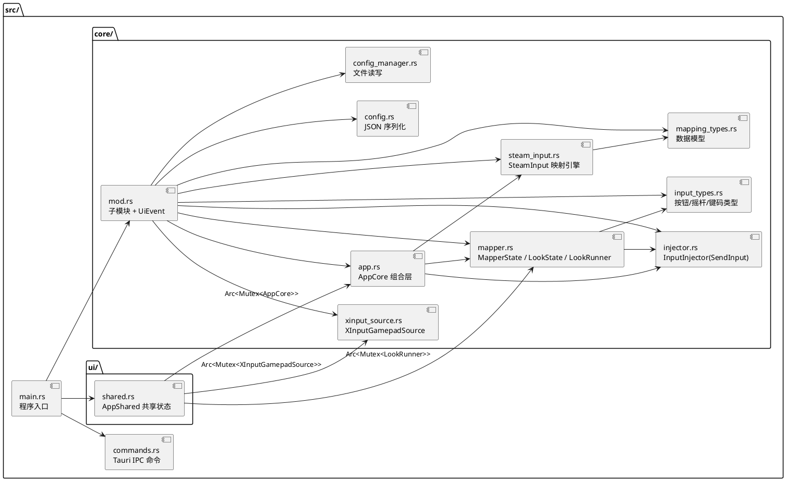

---

## 4. 类图（核心类型）

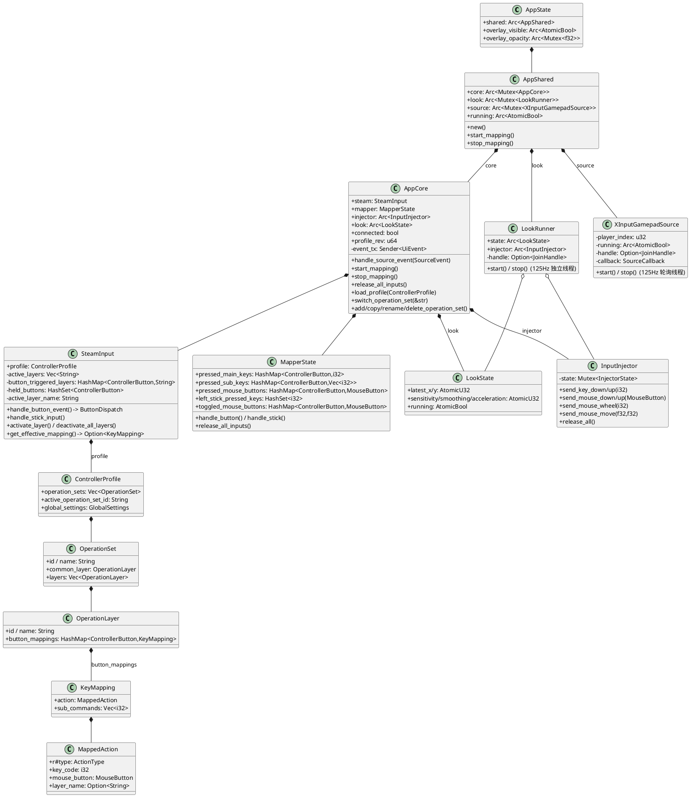

**关键关系**：`AppCore` 是组合核心（`SteamInput` 负责映射查询与分发，`MapperState` 负责注入状态跟踪，`InputInjector` 负责 SendInput），三者在**同一把锁**（`Arc<Mutex<AppCore>>`）内串行访问；`LookRunner` 是唯一脱离 AppCore 锁的独立线程（通过 `LookState` 原子量 + 共享 `Injector`）。

---

## 5. 数据模型（三层结构，自顶向下）

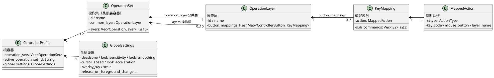

**查询顺序（`get_effective_mapping`）**：从**最后激活的操作层** → 依次往前 → **公共层（兜底，优先级最低）**，返回第一个命中映射。切层动作由公共层中的 `SwitchLayer` 映射触发（按下激活、松开回退）。

**动作类型枚举 `ActionType`**：`KeyboardKey / MouseClick / SwitchLayer / MouseMove / LookAround / MouseToggle / WheelUp / WheelDown / ToggleMapping / ToggleOnScreenKeyboard / ToggleOverlay`。

---

## 6. 数据流（线性模型）

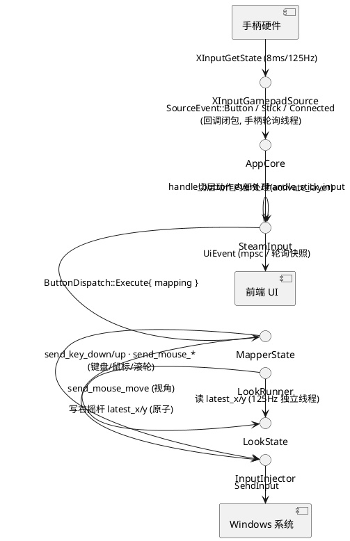

**线程模型**：

| 线程 | 职责 | 访问方式 |
|---|---|---|
| 手柄轮询线程（`XInputGamepadSource`） | 125Hz 轮询 XInput，发出按钮/摇杆/连接事件 | 回调内 `lock(core)` → `handle_source_event` |
| 视角线程（`LookRunner`） | 125Hz 固定节拍，读右摇杆原子量 → 平滑 → 注入鼠标移动 | 独立读 `LookState` 原子量 + 共享 `Injector`（不经 AppCore 锁） |
| Tauri 主/UI 线程 | 运行 invoke 命令、周期取快照刷新界面、管理启停 | `lock(core)` 短临界区 |
| 核心→UI 事件 | `mpsc::Sender<UiEvent>` 非阻塞发送 | 轮询 drain |

---

## 7. 时序图

### 7.1 手柄按钮按下 → 注入（主流程）

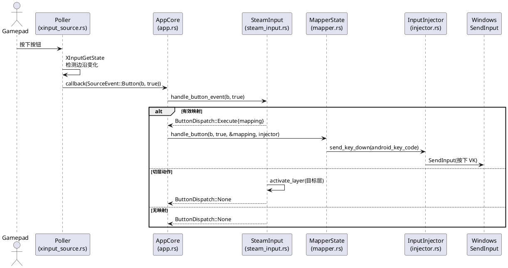

### 7.2 松开 → 精确释放

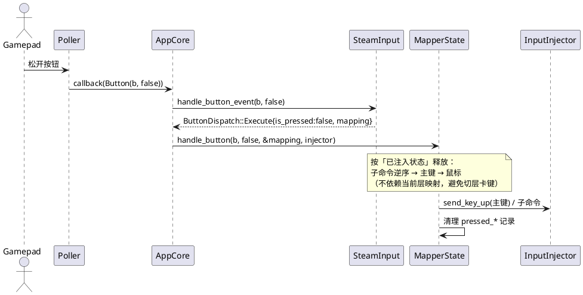

### 7.3 视角控制（右摇杆 → 鼠标移动）

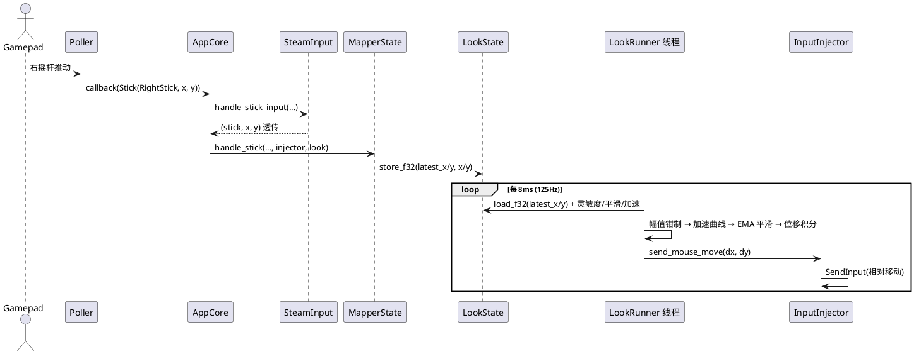

### 7.4 应用启动

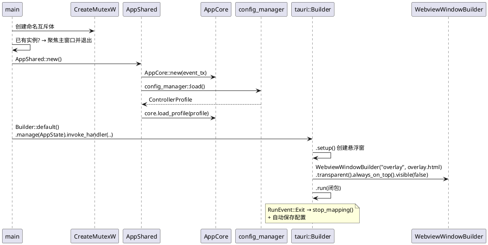

### 7.5 前端修改按键映射（invoke）

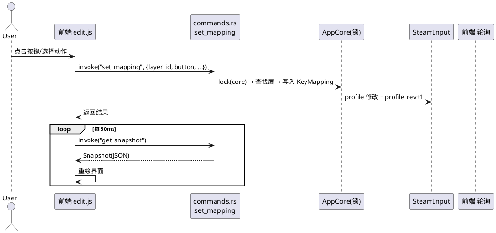

---

## 8. Rust 语法要点

> 摘自源码内 `// 【Rust 语法】` 注释，按主题归类。

| 语法 | 说明 | 示例位置 |
|---|---|---|
| 所有权 / 借用 | `&T` 不可变借用、`&mut T` 可变借用、按值转移所有权；借用不拥有数据 | `fn find_layer_ref(&self, ...)` |
| `&self` / `&mut self` | 实例方法：只读方法用 `&self`，需修改自身用 `&mut self` | `AppCore::switch_operation_set(&mut self)` |
| `Arc<T>` | 原子引用计数智能指针，多线程共享同一份数据的所有权 | `Arc<Mutex<AppCore>>` |
| `Mutex<T>` | 互斥锁，提供多线程安全可变访问；`lock()` 返回 `MutexGuard`（RAII 自动释放） | `shared.core.lock()` |
| 原子类型 | `AtomicBool` / `AtomicU32`，无需锁跨线程读写；Rust 无 `AtomicF32`，用 `to_bits()/from_bits()` 存 f32 位模式 | `LookState` 字段 |
| 枚举携带数据 | 枚举变体可携带数据：单元变体 / 结构体变体 `Execute { is_pressed, mapping }` | `ButtonDispatch`、`UiEvent` |
| `match` 穷尽匹配 | 对枚举/值做模式匹配，可解构携带字段 | `handle_source_event` |
| `#[derive(...)]` | 派生宏：自动实现 `Debug/Clone/Copy/PartialEq/Eq/Hash/Default/Serialize` 等 trait | 各数据模型 |
| `trait`（特征） | 接口机制；`impl Default for T`、`impl Drop for T`（析构） | `GlobalSettings`、`LookRunner` |
| `Option<T>` / `Result<T,E>` | `Some/None`、`Ok/Err`；`unwrap()` / `unwrap_or()` / `unwrap_or_default()` | 大量返回值 |
| 迭代器链 | `iter() → filter(闭包) → map(闭包) → collect()` 函数式管道 | `unique_set_name`、断开清理 |
| 闭包 `move` | 把捕获变量所有权移入闭包，配合 `thread::spawn` | 手柄回调、轮询线程 |
| 线程 | `thread::spawn` 返回 `JoinHandle`；`join()` 等待线程结束 | `XInputGamepadSource`、`LookRunner` |
| mpsc 通道 | `channel()` 返回 `(Sender, Receiver)`，多生产者单消费者 | `AppShared::new` |
| 生命周期 `'a` | 显式标注引用存活范围，如 `find_layer_ref<'a>(...) -> Option<&'a ...>` | `commands.rs` |
| `let-else` | `let Ok(x) = ... else { return };` 模式匹配失败走 else | `focus_existing_main_window` |
| `?` 错误传播 | `Result` 的 `Err` 自动提前返回 | `setup` 中 `.build()?` |
| `unsafe` + FFI | 调用 Windows API / SendInput 必须包裹 `unsafe` 块 | `injector.rs`、`main.rs` |
| `r#type` 原始标识符 | `type` 是关键字，用 `r#` 前缀当字段名 | `MappedAction.r#type` |
| 字段简写 | 字段名与变量同名时省略 `字段: 值` | `Self { injector, event_tx }` |

---

## 9. Tauri 语法要点

| 语法 | 说明 | 示例位置 |
|---|---|---|
| `#[tauri::command]` | 把函数注册为前端可 `invoke` 的 IPC 命令；参数自动从 JSON 反序列化，返回值自动序列化 | `commands.rs` 全部命令 |
| `tauri::generate_handler![...]` | 属性宏：生成命令分发器，列出所有可调用命令 | `main.rs` |
| `.manage(AppState)` | 注入全局状态，命令中用 `State<'_, AppState>` 获取 | `main.rs` |
| `State<'_, AppState>` | 命令参数：自动注入 `.manage()` 的共享状态 | `get_snapshot(state: State<AppState>)` |
| `AppHandle` | 应用句柄：窗口管理、退出等 | `toggle_overlay(app: AppHandle)` |
| `.setup(闭包)` | 应用初始化后回调，常用来创建额外窗口 | 创建悬浮窗 |
| `WebviewWindowBuilder` | 链式配置 Webview 窗口：`title/inner_size/resizable/decorations/transparent/always_on_top/skip_taskbar/visible/build()` | 悬浮窗 |
| `tauri::WebviewUrl::App("overlay.html")` | 加载打包资源中的前端页面 | 悬浮窗 |
| `tauri::generate_context!()` | 编译期生成应用上下文（内嵌前端资源），失败用 `expect` 崩溃 | `main.rs` |
| `.run(|app, event| ...)` | 运行事件循环；`RunEvent::Exit` 捕获退出事件做收尾 | 退出钩子 |
| `Manager` trait | `state()` / `get_webview_window()` 等方法 | `main.rs` use |
| 前端调用 | `window.__TAURI__.core.invoke("命令名", 参数)` 返回 Promise | `frontend/*.js` |
| 前端事件 | 后端 `emit` 事件，前端监听（本项目用轮询 + mpsc 内聚） | `frontend/*.js` |

---

## 10. commands.rs IPC 命令清单

> 前端通过 `window.__TAURI__.core.invoke("命令名", 参数)` 调用，返回值为 Promise（对象自动序列化为 JSON）。
> 全部命令运行在 Tauri 主线程，内部短时 `lock(core)` 访问共享状态。

### 10.1 命令总表

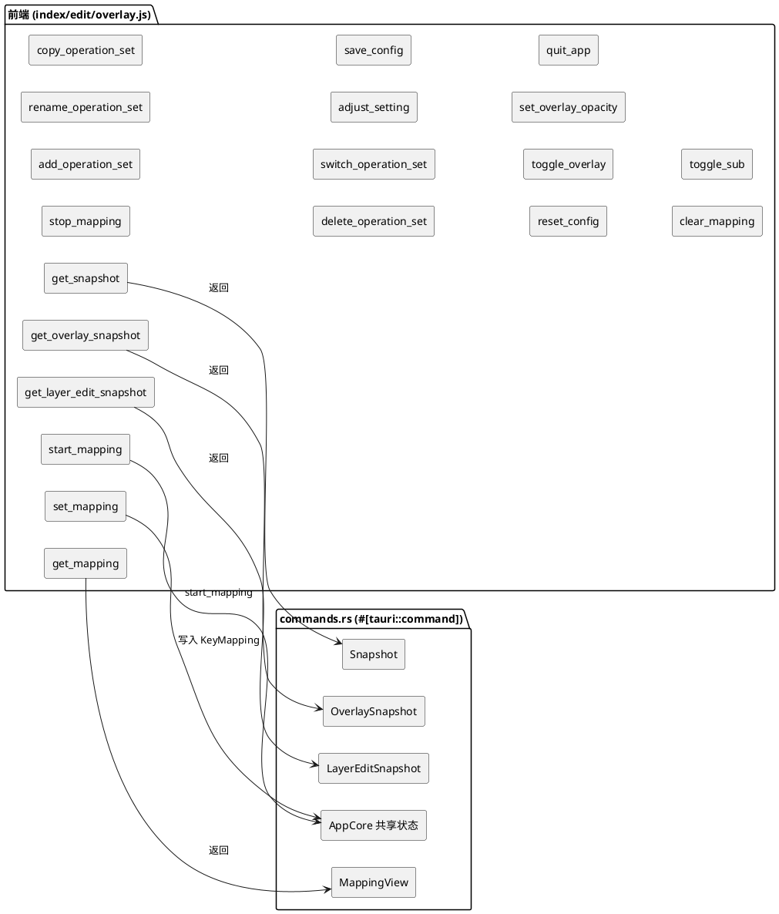

### 10.2 命令明细

| # | 命令 | 参数（后端） | 返回 | 说明 |
|---|---|---|---|---|
| 1 | `get_snapshot` | `state` | `Snapshot` | 主窗口整体快照（连接/运行/操作集/层/锁存/全局设置），前端约 50ms 轮询 |
| 2 | `get_overlay_snapshot` | `state` | `OverlaySnapshot` | 悬浮窗快照（操作集名/层名/按下按钮/锁存/映射行/透明度） |
| 3 | `start_mapping` | `state` | `()` | 开始映射：更新视角参数 → 启 look 线程 → 启手柄轮询 |
| 4 | `stop_mapping` | `state` | `()` | 停止映射：停 look/轮询 → 释放全部注入 → 清层栈 |
| 5 | `add_operation_set` | `state` | `String` | 新增操作集（自动 id + 防重名），返回新 id |
| 6 | `rename_operation_set` | `state, set_id: String, name: String` | `bool` | 重命名操作集（空名拒绝） |
| 7 | `copy_operation_set` | `state, set_id, name` | `bool` | 复制操作集为新集（新 id + 新名） |
| 8 | `delete_operation_set` | `state, set_id` | `bool` | 删除操作集（至少保留 1 个；删除激活集则回退到第一个） |
| 9 | `switch_operation_set` | `state, set_id` | `bool` | 切换激活操作集（`deactivate_all_layers` 后切换） |
| 10 | `adjust_setting` | `state, key: SettingKey, delta: f32` | `()` | 调整全局设置项（增/减，带 clamp 限幅），`SettingKey` 序列化为 snake_case |
| 11 | `save_config` | `state` | `()` | 锁内克隆 profile → `config_manager::save` 写盘 |
| 12 | `reset_config` | `state` | `()` | `reset_to_default()` → 重新加载默认并载入核心 |
| 13 | `toggle_overlay` | `app: AppHandle, state` | `bool` | 切换悬浮窗显隐（`get_webview_window("overlay")` + show/hide），返回新状态 |
| 14 | `set_overlay_opacity` | `state, opacity: f32` | `()` | 设置悬浮窗透明度（clamp 0.2~1.0） |
| 15 | `quit_app` | `app: AppHandle` | `()` | 停止映射释放注入 → `app.exit(0)` 退出 |
| 16 | `get_layer_edit_snapshot` | `state, layer_id: String` | `LayerEditSnapshot` | 层编辑页数据：层名 + 可切换目标 + 按钮网格（含按持高亮） |
| 17 | `get_mapping` | `state, layer_id, button: String` | `MappingView` | 读取单个按键映射（kind/desc/subs/has_mapping）；无效则 `MappingView::none()` |
| 18 | `set_mapping` | `state, layer_id, button, kind, key_code?: Option<i32>, mouse_button?: Option<String>, layer_name?: Option<String>` | `()` | 写入按键映射：按 `kind` 构建 `MappedAction`，**保留已有子命令**，`profile_rev+1` |
| 19 | `clear_mapping` | `state, layer_id, button` | `()` | 删除该按钮映射，`profile_rev+1` |
| 20 | `toggle_sub` | `state, layer_id, button, key_code: i32` | `()` | 增删子命令（组合键）：存在则移除，否则追加（上限 `MAX_SUB_COMMANDS=3`） |

### 10.3 序列化 DTO（derive Serialize）

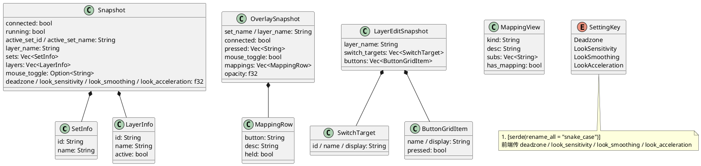

### 10.4 前端调用示例

```javascript
// 读取快照
const snap = await window.__TAURI__.core.invoke("get_snapshot");

// 写入按键映射（键盘）
await window.__TAURI__.core.invoke("set_mapping", {
  layerId: "Layer1",      // Tauri 参数名自动转 snake_case: layer_id
  button: "A",
  kind: "keyboard",
  keyCode: 51,            // W 键（Android KeyCode）
});

// 调整全局设置
await window.__TAURI__.core.invoke("adjust_setting", {
  key: "look_sensitivity",
  delta: 0.1,
});
```

> 注：Tauri 1.x 前端参数使用 **camelCase**，后端 Rust 参数为 **snake_case**，由 `#[tauri::command]` 自动互相映射；后端返回结构体字段则保持 Rust 命名。

---

## 11. 设计规则与注意点

### 11.1 关键设计规则

1. **KeyCode 使用 Android 常量**：配置与核心层存储 Android KeyEvent 值（`W=51`、`Space=62`），运行时经 `android_key_code_to_windows_vk()` 转 Windows VK 再注入。**配置/核心逻辑禁止直接使用 Windows VK 常量**。
2. **层查询顺序**：当前操作集内，从**最后激活的操作层 → 公共层**，返回第一个命中映射。
3. **操作集切换安全**：切换 / 新增 / 删除操作集前必须先 `deactivate_all_layers()`——`Vec<OperationSet>` 扩容会使已激活层的指针悬垂（悬垂指针 → 卡键/崩溃）。**始终保持至少 1 个操作集**。
4. **精确释放**：松开按键按「已注入状态」释放（子命令逆序 → 主键 → 鼠标），而非按当前层映射，防止切层时卡键。
5. **手柄断开防卡键**：连续 `MAX_CONNECTION_FAILS` 次轮询失败判定断开 → 释放全部已按下按钮 → `release_all_inputs()`。

### 11.2 线程模型注意点

- 手柄轮询线程经**回调闭包**直接 `lock(core)` 执行映射+注入（不经事件队列，保证低延迟）；UI 线程也通过同一把锁访问 → 天然串行化。
- **look 线程独立于 AppCore 锁**：只读 `LookState` 原子量 + 用共享 `InputInjector`（内部自带 `Mutex`），固定 8ms 节拍。
- 停止顺序与启动相反：先停 look 线程与手柄轮询，最后锁 core 释放全部注入。
- `release_all_inputs` 必须处理 `MouseToggle` 锁存（`drain()` 后逐个发 `UiEvent::MouseToggleChanged{active:false}`），防止断开后鼠标键卡死。

### 11.3 其他注意点

- **单实例**：`CreateMutexW("Global\\GamepadControlerTauriSingleInstance")`，已有实例则聚焦主窗口（`FindWindowW` + `SetForegroundWindow`）后退出。
- **悬浮窗**：`transparent(true)` + `always_on_top(true)` + `decorations(false)` + `skip_taskbar(true)` + 默认 `visible(false)`；透明度由 `overlay_opacity: Arc<Mutex<f32>>` 控制，前端应用于卡片背景 alpha。
- **配置保存时机**：`RunEvent::Exit` 钩子中 `stop_mapping()`（释放注入防卡键）+ 自动保存 `steamlike_config.json`。
- **前端刷新方式**：JS 以约 50ms 周期 `invoke("get_snapshot")` 轮询渲染；后端配置变更通过 `profile_rev` 修订号触发 UI 重绘。
- **子命令上限**：`KeyMapping::MAX_SUB_COMMANDS = 3`，`toggle_sub` 命令按此限制增删组合键。
