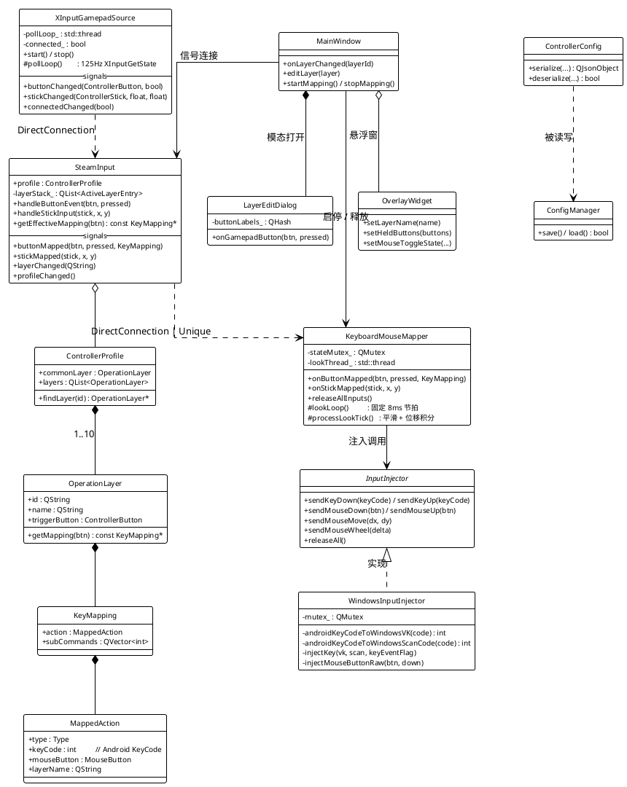
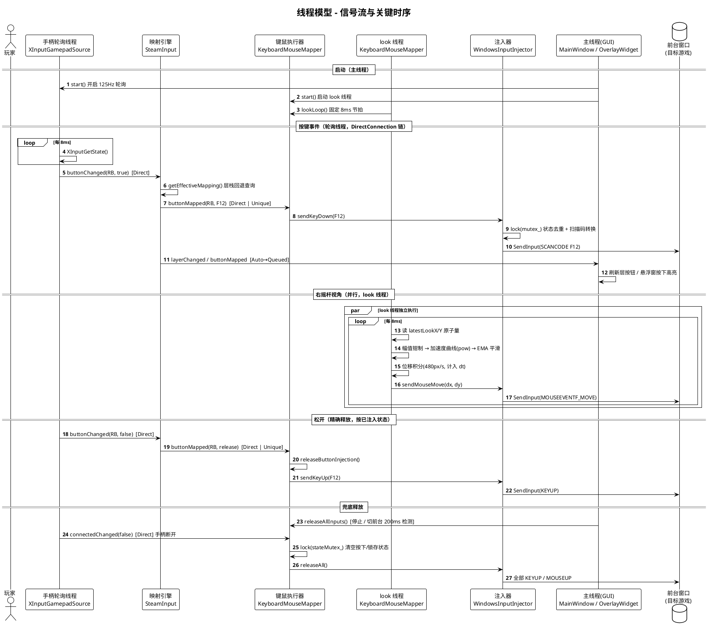
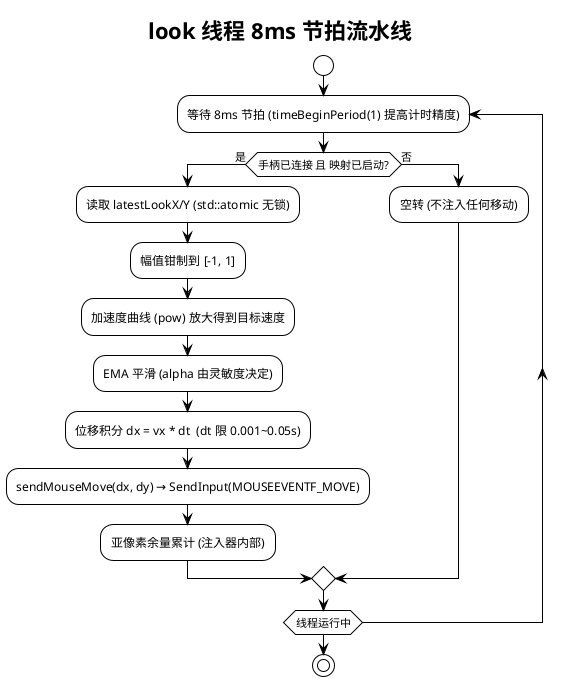

# GamepadControllerQt

Windows 本机手柄 → 键鼠映射器（Qt Widgets GUI）。参考 `L:\steamlike` 安卓工程移植，去除跨机器桥接（TCP）、Android 悬浮窗/前台服务等逻辑，手柄与键鼠注入均在本机完成。

- **手柄读取**：Windows 原生接口 **XInput**（`XInputGetState`，125Hz 轮询，不使用 QtGamepad）
- **键鼠注入**：`SendInput()` 直接注入到当前前台窗口
- **UI**：Qt Widgets（Qt 5.12+ / Qt 6 均可）

---

## 功能特性

- **公共层 + 操作层架构**：公共层始终激活（兜底），操作层通过公共层的 `SwitchLayer` 映射「按住激活、松开回退」
- **最多 10 个操作层**：WoW 预设（Layer1 战斗 / Layer2 骑乘 / …），显示名可自由修改
- **子命令组合键**：每个按键映射最多 3 个子命令，实现 `Alt+3` 等组合键（按住依次按下、松开逆序释放）
- **左摇杆 WASD 移动**：8 方向，阈值 0.5
- **右摇杆视角控制**：独立线程 125Hz 节拍，加速度曲线 + EMA 平滑 + 位移积分
- **MouseToggle 长按锁存**：按住期间鼠标键保持按下（主动锁存，松开不改变状态）
- **鼠标滚轮动作**：映射动作支持「滚轮上滚 / 滚轮下滚」，按下即注入一次滚轮事件
- **悬浮层信息窗**：独立置顶窗口，实时显示当前层与按下的手柄按键，可拖动、主窗口最小化不隐藏；在悬浮窗上滚动鼠标滚轮可缩放窗口大小
- **窗口位置记忆**：主窗口位置、悬浮窗位置与缩放比例均持久化到配置，下次启动恢复
- **配置持久化**：JSON（version=2），与安卓版 `steamlike_config.json` 格式兼容，可互换
- **托盘行为**：最小化主窗口隐藏到系统托盘（任务栏不显示图标）；「关闭时退出程序」选项决定点关闭是退出还是最小化到托盘

---

## 目录结构

```
GamepadControlerQt/
├── CMakeLists.txt
├── src/
│   ├── main.cpp                 # 程序入口，组装各组件
│   ├── core/                    # 核心逻辑（无 UI 依赖）
│   │   ├── InputTypes.h/.cpp        # 枚举/向量/名称转换（Android KeyCode 常量）
│   │   ├── MappingTypes.h/.cpp      # 数据模型：MappedAction/KeyMapping/OperationLayer/Profile
│   │   ├── SteamInput.h/.cpp        # 映射引擎：层管理 + 按键查询 + 输入分发
│   │   ├── InputInjector.h/.cpp     # 注入器接口 + Windows SendInput 实现 + VK 映射表
│   │   ├── KeyboardMouseMapper.h/.cpp  # 键鼠执行器：按钮/子命令/WASD/右摇杆视角线程
│   │   ├── ControllerConfig.h/.cpp  # JSON 序列化（version=2）
│   │   └── ConfigManager.h/.cpp     # 配置文件读写（exe 目录 + steamlike_config.json）
│   ├── gamepad/
│   │   └── XInputGamepadSource.h/.cpp  # XInput 手柄轮询源
│   └── ui/
│       ├── MainWindow.h/.cpp        # 主窗口（层按钮/设置滑块/启停/保存）
│       ├── LayerEditDialog.h/.cpp   # 操作层编辑对话框
│       ├── OverlayWidget.h/.cpp     # 悬浮层信息窗口
│       ├── HelpDialog.h/.cpp        # 使用说明对话框
│       ├── DarkTitleBar.h           # 深色标题栏工具（DwmSetWindowAttribute）
│       └── res.qrc / icons/         # 资源文件与图标（下拉箭头 PNG）
```

---

## 构建

依赖：CMake 3.16+、Qt Widgets（Qt 5.12 或 Qt 6）、编译工具链。

### Qt 6（msys2 UCRT64）

```powershell
cmake -S . -B build-qt6 -G "Ninja" `
  -DCMAKE_PREFIX_PATH=I:/msys64/ucrt64 `
  -DCMAKE_CXX_COMPILER=I:/msys64/ucrt64/bin/g++.exe `
  -DCMAKE_MAKE_PROGRAM=I:/msys64/ucrt64/bin/ninja.exe `
  -DCMAKE_BUILD_TYPE=Release
cmake --build build-qt6
```

> 若 PATH 中已有 msys2 的 `qmake6.exe`，可省略 `-DCMAKE_PREFIX_PATH`（CMake 会通过 qmake 反推安装前缀）。

### Qt 5（H:\Qt\5.15.2\mingw81_64）

```powershell
cmake -S . -B build -G "Ninja" `
  -DCMAKE_PREFIX_PATH=H:/Qt/5.15.2/mingw81_64 `
  -DCMAKE_CXX_COMPILER=H:/Qt/Tools/mingw810_64/bin/g++.exe `
  -DCMAKE_MAKE_PROGRAM=H:/Qt/Tools/Ninja/ninja.exe `
  -DCMAKE_BUILD_TYPE=Release
cmake --build build
```

### 运行

Qt 5 需要把 Qt 的 bin 加入 PATH：

```powershell
$env:PATH = "H:\Qt\5.15.2\mingw81_64\bin;" + $env:PATH
build\GamepadControllerQt.exe   # 或 build-qt6\GamepadControllerQt.exe
```

---

## 架构与数据流

整体是单向数据流，手柄输入经过「读取 → 映射 → 执行 → 注入」四段流水线，不存在反向依赖：

```
                        ┌───────────────────────────────────────────────┐
                        │                主线程（GUI / 事件循环）          │
                        │  MainWindow / LayerEditDialog / OverlayWidget   │
                        │  ConfigManager（保存/加载）/ 托盘 / 前台监控定时器 │
                        └───────────────────────────────────────────────┘
                                        ▲                    │
                           layerChanged/buttonMapped 等信号    │ 启停 / releaseAllInputs
                           （AutoConnection 转队列到主线程）     │
                                        │                    ▼
┌──────────────────┐ 按钮/摇杆/连接 ┌───────────────┐ buttonMapped ┌─────────────────────┐
│ XInputGamepadSource │────────────►│   SteamInput  │─────────────►│ KeyboardMouseMapper │
│  独立轮询线程 125Hz  │ DirectConnection │ 映射引擎（层栈）│ DirectConnection │  键鼠执行器 + look 线程 │
└──────────────────┘              └───────────────┘              └──────────┬──────────┘
                                                                             │ SendInput
                                                                             ▼
                                                                     Windows 前台窗口（目标游戏）
```

### 框架模型（模块与职责）

| 模块 | 职责 | 运行线程 |
|---|---|---|
| `main.cpp` | 组件装配、信号接线（DirectConnection）、退出清理 | 主线程 |
| `XInputGamepadSource` | XInputGetState 125Hz 轮询，发出按钮/摇杆/连接变化信号 | 独立轮询线程 |
| `SteamInput` | 层栈管理、有效映射查询、输入分发、SwitchLayer 运行时处理（纯核心，无 UI 依赖） | 轮询线程（信号处理） |
| `KeyboardMouseMapper` | 按钮/子命令组合键/WASD 移动执行；右摇杆视角（独立 look 线程） | 轮询线程 + look 线程 |
| `WindowsInputInjector` | SendInput 注入、Android 键码 → VK/物理扫描码转换、按键状态去重 | 多线程（内部互斥） |
| `ControllerConfig` / `ConfigManager` | JSON（version=2）序列化与配置文件读写（exe 同目录 `steamlike_config.json`） | 主线程 |
| `MainWindow` | 主界面、层编辑入口、启停控制、全局设置、托盘、前台窗口监控 | 主线程 |
| `LayerEditDialog` | 操作层映射编辑（「副本模式」：编辑副本，确定才写回；手柄按键实时高亮） | 主线程（模态） |
| `OverlayWidget` | 悬浮信息窗（当前层/按下按键/展开映射列表/MouseToggle 锁存提示） | 主线程 |
| `HelpDialog` / `DarkTitleBar` | 使用说明对话框 / 深色标题栏工具 | 主线程 |

**核心类关系图（PlantUML 类图）**：



对象所有权与生命周期：

- 核心对象创建于 `main()` 栈上（`SteamInput input`、`KeyboardMouseMapper mapper`、`XInputGamepadSource gamepad`），随事件循环退出统一析构。
- `InputInjector` 由工厂 `createWindowsInputInjector()` 返回**原始指针**，调用方负责 `delete`（main.cpp 退出时释放）。
- 注入器持有所有「当前按下」状态（键盘/鼠标键）。程序退出、手柄断开、停止映射、切换前台窗口四条路径都会走 `releaseAllInputs()` 兜底释放，防止按键卡死。

关键设计规则：

1. **KeyCode 一律使用 Android 常量**：配置与核心层保存 Android KeyEvent 值（空格=62、W=51…），运行时经 `androidKeyCodeToWindowsVK()` / `androidKeyCodeToWindowsScanCode()` 转换。绝不在配置/核心逻辑中使用 Windows VK 常量。
2. **注入用扫描码模式**：`injectKey` 用 `KEYEVENTF_SCANCODE`（`wVk=0`、`wScan` 为物理扫描码），DirectInput / Raw Input / GetAsyncKeyState 都能读到。扫描码必须查表：数字键、F11/F12（0x57/0x58）、小键盘均**非连续**，按公式推算会错键（例如 F12 会算出 ScrollLock）。
3. **层查询顺序**：`getEffectiveMapping` 从最后激活的操作层回退到公共层，返回第一个命中；公共层始终激活、优先级最低。
4. **层切换**：`SwitchLayer` 动作由引擎 `handleButtonEvent` 处理——按下激活目标层并记录触发按钮，松开停用该层并直接返回（不触发映射）。`triggerButton` 仅 UI 展示，不参与运行时切换。
5. **精确释放**：松开按键按「已注入状态」（`releaseButtonInjection`）释放，与当前层映射无关，防止长按切层键后按键卡死。
6. **MouseToggle 锁存**：按住期间鼠标键保持按下（用户主动锁存），松开手柄键不改变状态，再按一次解除；断开/停止/切前台时统一释放并通知 UI。
7. **UAC 提权**：`app.manifest` 声明 `requireAdministrator`。目标游戏若高完整性运行（如 WoW），未提权时 SendInput 会被 UIPI 静默拦截，因此必须提权运行。
8. **WIN32 子系统**：`add_executable(... WIN32 ...)` 无控制台窗口，调试输出走 Qt debug 或日志文件。
9. **连接防抖**：连续 3 次轮询失败才判定断开（`MAX_CONNECTION_FAILS`），避免 USB 抖动导致状态闪烁；断开时释放全部注入。
10. **DirectConnection**：轮询线程 → SteamInput、SteamInput → Mapper 均用 `Qt::DirectConnection` 保证低延迟（原因详见线程模型）。

### 线程模型

程序共 3 个线程 + 1 个 GUI 定时器：

| 线程 | 创建位置 | 职责 |
|---|---|---|
| 主线程（GUI） | 程序入口 | Qt 事件循环、全部 UI、配置读写、托盘、`onCheckForeground`（200ms 前台监控）、`releaseAllInputs` |
| 手柄轮询线程 | `XInputGamepadSource::pollLoop`（std::thread） | 每 8ms（≈125Hz）`XInputGetState`，发出按钮/摇杆/连接变化信号 |
| look 线程 | `KeyboardMouseMapper::lookLoop`（std::thread） | 固定 8ms 节拍，读取右摇杆原子量 → 加速度/平滑 → 注入鼠标移动 |

**线程间通信（信号连接类型）**：

| 信号 → 槽 | 连接类型 | 原因 |
|---|---|---|
| 手柄 `buttonChanged`/`stickChanged` → `SteamInput::handleButtonEvent/handleStickInput` | `DirectConnection` | 轮询线程即时处理，低延迟 |
| 手柄 `connectedChanged` → mapper 释放全部注入 | `DirectConnection` | 断开瞬间兜底释放，防卡键 |
| `SteamInput::buttonMapped`/`stickMapped`/`profileChanged` → mapper | `DirectConnection \| UniqueConnection` | 注入必须在轮询线程执行，绝不进主线程事件队列（见下） |
| `SteamInput::layerChanged`/`buttonMapped` → `MainWindow`（层按钮/悬浮窗刷新） | Auto（自动转 Queued） | UI 更新必须在主线程 |
| `KeyboardMouseMapper::mouseToggleChanged` → 悬浮窗/主窗口 | Auto（Queued） | UI 更新在主线程 |
| 手柄 `buttonChanged` → `LayerEditDialog::onGamepadButton` | `QueuedConnection`（显式） | 模态对话框内更新列表高亮，必须在主线程 |

**线程模型时序（PlantUML 时序图）**：



**为什么注入必须用 DirectConnection**：
若 `buttonMapped → mapper` 用默认 AutoConnection（接收者在主线程）会变成 QueuedConnection，所有注入都排队到主线程执行。一旦注入的鼠标按下恰好落在本程序自身标题栏上，Windows 会进入非客户区模态追踪循环阻塞主线程，后续松开事件排不进事件队列 → 鼠标卡死、UI 冻结。DirectConnection 让轮询线程直接执行注入，即使主线程被模态循环占用，轮询线程仍能发出松开事件解除循环。

**数据同步**：

- `KeyboardMouseMapper::stateMutex_`（QMutex）：串行化「轮询线程的 onButtonMapped/onStickMapped」与「主线程的 releaseAllInputs」，保护按下状态容器（主键/子命令/鼠标键/锁存/WASD 键）。无锁时两者并发修改状态会导致 down/up 不对称——例如注入 leftdown 后 releaseAllInputs 清空状态，松开时 up 被吞 → 鼠标键永久卡死。
- `WindowsInputInjector::mutex_`（QMutex）：保护注入器的按键去重集合与亚像素鼠标余量；轮询线程、look 线程、主线程并发调用均安全。
- `std::atomic`：`running_`、右摇杆最新值 `latestLookX/Y`、视角参数（灵敏度/平滑/加速度）——look 线程无锁读取。

**look 线程流水线（PlantUML 活动图）**：



look 线程用 `timeBeginPeriod(1)` 提高系统计时器分辨率保证 8ms 节拍；实际处理耗时计入 dt（限 0.001~0.05s），作为位移积分的时间基准，避免节拍抖动导致视角速度不稳。

**释放兜底路径**（统一调用 `releaseAllInputs`）：

| 触发场景 | 调用线程 |
|---|---|
| 用户停止映射 / 关闭程序（`mapper.stop()`） | 主线程 |
| 手柄断开（`connectedChanged(false)`） | 轮询线程（DirectConnection） |
| 前台窗口切换（`onCheckForeground` 每 200ms 检测，可配 `releaseOnForegroundChange`） | 主线程 |

---

## 配置格式（JSON version=2）

配置文件路径：`<exe目录>\steamlike_config.json`（与安卓版同名，可互换）。

```json
{
  "version": 2,
  "globalSettings": {
    "deadzone": 0.15,
    "lookSensitivity": 0.5,
    "cursorSpeed": 1.0,
    "lookSmoothing": 0.5,
    "lookAcceleration": 1.5
  },
  "commonLayer": {
    "id": "Common",
    "name": "Common",
    "buttonMappings": {
      "A": { "action": { "type": "keyboard", "keyCode": 62 } },
      "B": { "action": { "type": "mouse", "button": "RIGHT" } },
      "DPAD_UP": { "action": { "type": "switchLayer", "layerName": "Layer1" } }
    }
  },
  "layers": [
    {
      "id": "Layer1",
      "name": "Layer1 战斗",
      "triggerButton": "DPAD_UP",
      "buttonMappings": {
        "X": {
          "action": { "type": "keyboard", "keyCode": 51 },
          "subCommands": [ 57 ]
        }
      }
    }
  ]
}
```

### 字段说明

| 字段 | 说明 |
|---|---|
| `version` | 配置版本号，必须为 2，否则拒绝加载 |
| `globalSettings` | 死区 / 灵敏度 / 光标速度（预留）/ 平滑 / 加速度；`invertLookX/Y` 视角翻转开关；`overlayX/Y`/`overlayScale` 悬浮窗位置与缩放（-1 / 1.0 表示未保存过）；`mainWindowX/Y` 主窗口位置（-1 表示未保存过）；`releaseOnForegroundChange` 前台窗口切换时是否释放注入（默认 true）；`confirmOnClose` 「关闭时退出程序」选项：true 点关闭直接退出，false 点关闭最小化到托盘 |
| `commonLayer` / `layers` | 层对象；`id` 唯一标识（运行时定位用，重命名不影响），`name` 显示名可修改 |
| `triggerButton` | 仅 UI 展示用，不参与运行时层切换 |
| `buttonMappings` | 键名 -> 映射；键名见「手柄按键名」 |
| `action.type` | `keyboard` / `mouse` / `mouseToggle` / `switchLayer` / `mouseMove` / `lookAround` / `toggleMapping` / `toggleOnScreenKeyboard` / `toggleOverlay` |
| `action.keyCode` | Android KeyCode（如空格=62、W=51），运行时转为 Windows VK |
| `action.button` | 鼠标键大写名：`LEFT`/`RIGHT`/`MIDDLE`/`FORWARD`/`BACK` |
| `subCommands` | 子命令 Android KeyCode 数组（最多 3 个），组合键用 |

### 手柄按键名（buttonMappings 键名 / triggerButton）

`A` `B` `X` `Y` `LB` `RB` `LT` `RT` `L3` `R3` `MENU` `OPTIONS` `DPAD_UP` `DPAD_DOWN` `DPAD_LEFT` `DPAD_RIGHT`

- `MENU` = 手柄 START 键，`OPTIONS` = 手柄 BACK 键；`LT`/`RT` 为模拟扳机，压过半程（≥128）视为按下。
- `GUIDE`（Home 键）与 `TOUCHPAD_CLICK`（触控板点击）仅保留用于兼容安卓版配置，XInput 无对应物理位，不会产生输入。

---

## 使用说明

1. 启动程序，状态栏显示手柄连接状态；未连接时插入手柄即可自动识别。
2. 点击 **开始映射** 启用键鼠注入（默认已启动）。
3. 层切换由「切换层」动作驱动：在公共层（或其他层）为某手柄按键设置「切换层」动作，按住即临时激活目标操作层、松开回到公共层。默认配置不预设层切换映射，需自行配置。
4. 点击层按钮可打开该层的按键映射编辑对话框；点击「编辑公共层…」编辑公共层映射。
5. 全局设置滑块实时生效（死区、视角灵敏度、平滑、加速度）。
6. 保存配置后写入 `steamlike_config.json`；重置默认恢复 WoW 预设。
7. 最小化主窗口后，悬浮层信息窗继续显示，可拖动到任意位置。
